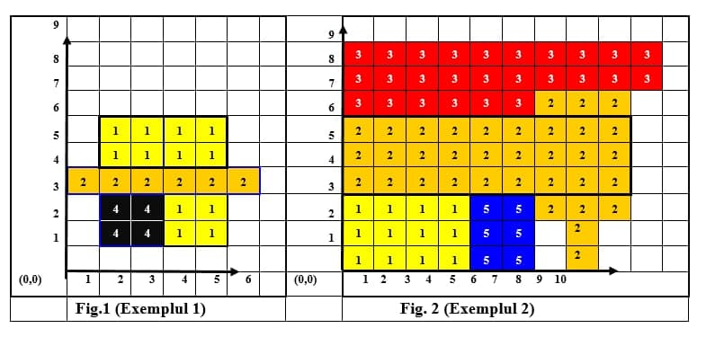
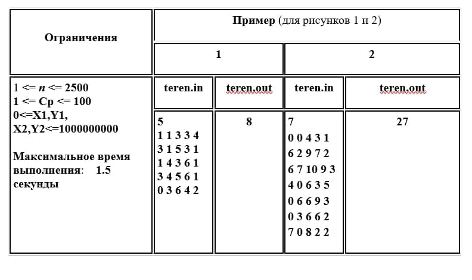

# Cultivated-Land-Practice-In-The-Second-Year-Of-College
This is my practical assignment, which I completed in my second year of college.

 

Cultivated land. In a rectangular XOY coordinate system, rectangles are drawn to represent the areas of land planted with crops of the same species. The sides of the parcels are parallel to the coordinate axes and the vertices of the rectangles have integer coordinates. Parcels can have common points only on the sides. Each type of culture is assigned a certain color with the Cp. Code (see fig. 1 and fig. 2)
Detailed information about the considered rectangles is written in the text file Teren.in, which contains in the first line a natural number n, which is the number of rectangles. Each of the next n lines of this file contains 5 integers, separated by one space: X1, Y1, X2, Y2, CP.
(X1, Y1) and (X2, Y2) are the coordinates of the two opposite vertices of the rectangle, and Cp contains the color code of the rectangle.
Develop an application that, using menus and subroutines, performs the following actions at the user's choice:
1. Adds to the text file Teren.in, a rectangle with the characteristics described earlier.
2. Removes from the text file Teren.in, a rectangle, the coordinates of two opposite sides of which are entered from the keyboard.
3. Constructs a rectangle of the minimum area with sides parallel to the coordinate axes, containing all the areas described in the input file.
4. Finds the total area
5. Identifies the crop (color) that occupies the largest area of all plots.
6. Creates the ColColumn.txt file by copying those lines of the Teren.in input file that correspond to the color code (Cp) entered from the keyboard.
7. Redistributes the lines of the input file in ascending order of crop color codes.
8. Solve the problem. Mariuka flies for the first time by plane. From the plane, she sees the land on which the crops described earlier are grown. Curious, the little girl would like to determine the area of ​​the largest rectangle occupied by crops of the same color. Develop a subroutine that will help Mariuke solve his problem.
Input data. The Teren.in file described earlier.
Output. The output file Teren.out contains one single value - the area of the largest rectangle occupied by crops of the same color.

 

